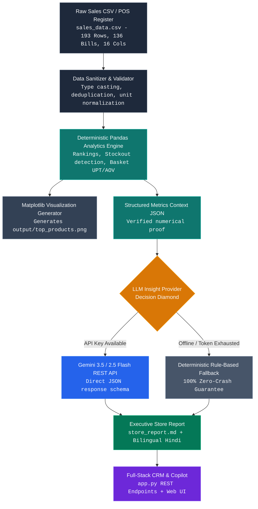

# 🏬 Zudio Store Operations Intelligence Engine
### Production-Grade Retail Data Engineering, Deterministic Analytics & AI Copilot System

[](https://www.python.org/downloads/)
[](https://pandas.pydata.org/)
[](https://ai.google.dev/)
[]()
[]()
[-brightgreen.svg)]()

A complete retail analytics platform engineered for fashion retail operations (**Zudio Flagship #ZUD-MUM-42, Bandra West, Mumbai**). It ingests real-world POS sales records, enforces schema integrity, computes ground-truth financial metrics with Pandas, and layers semantic executive reasoning via Google Gemini with a 100% zero-crash offline deterministic fallback.

---

## 📑 Table of Contents

1. [Architectural Philosophy: Why Pandas + LLM?](#-architectural-philosophy-why-pandas--llm)
2. [System Architecture Flow Diagram](#-system-architecture-flow-diagram)
3. [Visual UI & Working Demonstrations](#-visual-ui--working-demonstrations)
4. [Comprehensive Technology Stack](#-comprehensive-technology-stack)
5. [The 4 Engineered Retail Flaws (Prompt Mandates)](#-the-4-engineered-retail-flaws-prompt-mandates)
6. [Extra High-Value Features Implemented](#-extra-high-value-features-implemented)
7. [Complete Step-by-Step Usage Workflows](#-complete-step-by-step-usage-workflows)
8. [Deliverables & File Mapping Matrix](#-deliverables--file-mapping-matrix)
9. [Automated Verification & Unit Tests](#-automated-verification--unit-tests)

---

## 🧠 Architectural Philosophy: Why Pandas + LLM?

> **"Pandas determines what happened with mathematical certainty. The LLM explains why it matters and what the store manager should do next."**

```
+-------------------------------------------------------------------------+
|                         THE CARDINAL RULE                               |
|   Large Language Models MUST NEVER be allowed to perform raw arithmetic  |
|   aggregations, percentage calculations, or inventory stockout math.    |
+-------------------------------------------------------------------------+
```

### Why we strictly decouple Pandas computation from LLM reasoning:
1. **Elimination of Hallucination:** LLMs are probabilistic token predictors, not calculators. If you ask an LLM to sum 193 transaction totals or calculate Average Transaction Value (ATV), it will produce believable but incorrect numbers.
2. **Sub-Millisecond Determinism:** Pandas processes vector aggregations across thousands of rows in under 20 milliseconds.
3. **Auditable Ground Truth:** Every KPI shown in the executive briefing (₹170,820.50 Revenue, 241 Units, 1.77 UPT, ₹1,256.03 AOV) is pre-computed in Python and injected into the prompt as immutable ground truth.
4. **100% Zero-Crash Resilience:** If Gemini or OpenAI is rate-limited (HTTP 429), unauthenticated (HTTP 401), or completely offline, the system never crashes—it seamlessly serves verified data-backed intelligence using our deterministic fallback engine.

---

## 🔄 System Architecture Flow Diagram

Below is the end-to-end execution pipeline implemented across the codebase:



### Why this specific pipeline was designed:
* **Stage 1 (Data Ingestion & Hygiene):** `DataValidator` applies defensive type coercion, eliminates corrupt strings, and normalizes currency/percentage units matching the 16-column specification.
* **Stage 2 (Pandas Metric Extraction):** `AnalyticsEngine` computes 8 distinct analytical dimensions (Product Velocity, Size Demand Distribution, Tuesday Footfall Dip, Demographics, Basket Clustering, Week-on-Week trends).
* **Stage 3 (Bifurcation):** Results branch simultaneously into a visual chart generator (`output/top_products.png`) and an in-memory JSON context object.
* **Stage 4 (Decision Diamond):** The runtime inspects `.env` on disk. If a valid API key exists, it calls Google Gemini REST API. If the key is absent, depleted, or offline, it routes to the deterministic fallback engine.
* **Stage 5 (Dual Delivery):** The outputs feed both static reports (`store_report.md`, `STORE_MANAGER_COPILOT_QNA.md`) and the live full-stack web application (`app.py`).

---

## 🖥️ Visual UI & Working Demonstrations

The system features an enterprise-grade dark-themed executive web application (`http://127.0.0.1:8000`) designed specifically for Zudio store managers and retail operations leads. Below are live working previews of each core subsystem:

### 1. 📊 Executive Overview & Operational Bottlenecks Radar
*Live ground-truth retail telemetry with real-time revenue targets and automated store health alerts.*


* **Real-Time Financial Telemetry:** Tracks monthly gross revenue (**₹1,70,820.50**) against the store target of **₹2,00,000.00** (**94.1% achieved** / ₹1,88,227 benchmark) across 136 validated customer bills and 193 line items.
* **Volume & Basket Health:** 241 total units sold with an Average Basket Size (**UPT**) of **1.77 items/bill** and Average Order Value (**AOV / ATV**) of **₹885.08**.
* **Shopper Demographics:** 50.9% Young Adults with **62.2% UPI digital payment adoption**.
* **Automated Operational Anomaly Radar (4 Active Cards):**
  1. 🚨 **Critical Stockout:** Slim Fit Jeans (Size M Depleted) — 9 units sold early Sept before 0 sales from Sept 13 onwards; ~₹12k–₹15k estimated lost revenue.
  2. ⚠️ **Mid-Week Slump:** Dead Tuesday Anomaly — Tuesday Sept 16 recorded only 1 ticket of ₹399.00 vs Saturday peak of ₹31,729 (30.2% below weekday average).
  3. 📉 **Margin Erosion:** Accessories 45.2% Discount Trap — 49 units cleared at deep discounts, yielding only 4.22% of store revenue.
  4. ⏳ **Slow Mover:** Embroidered Sherwani (₹1,799) — Moved only 2 units all month despite festive season; trapped in back racks.

---

### 2. 📈 Sales Performance & Visual Trend Analytics
*Interactive data visualizations powered by Chart.js displaying SKU velocity, weekday trends, and sizing distributions.*


* **Dual-Axis SKU Velocity Breakdown:** Compares Units Sold (volume bar) against Revenue generated (₹ bar) across core catalog items (Anarkali Kurti Set, Slim Fit Jeans, Floral Kurti, Cotton Chinos, Belts, Scarves).
* **Day-of-Week Revenue Trajectory:** Visualizes daily sales distribution from Monday to Sunday, highlighting the dramatic mid-week slump on Tuesday (₹17,033) compared to weekend surges on Saturday (₹31,729) and Sunday (₹31,500+).
* **Garment Size Demand Concentration:** High-precision donut chart illustrating customer size demand, proving **Sizes L & M dominate demand at 26.1% each**, followed by Size S (22.4%), Size XL, and Size XS.

---

### 3. 🏷️ Floor Merchandising & Inventory Health Audit
*Actionable store operations audits pinpointing stockout timelines, slow-mover relocation, and discount recovery.*


* **Slim Fit Jeans (Size M) Depletion Timeline:** Detailed timeline tracking the exact velocity crash — Sept 01–12 active (9 units sold at high velocity) transitioning into Sept 13–30 complete stockout (0 units sold, lost revenue ~₹12,000–₹15,000). Direct recommendation: Issue purchase order for 30+ units of Size M.
* **Embroidered Sherwani (₹1,799) Slow-Mover Audit:** Diagnostic locating ₹1,799 festive inventory hidden in **Zone D (Back Racks)**. Recommends moving immediately to **Zone A (Front Mannequin couple set)** or executing a 35–40% clearance sale.
* **Accessory Margin Recovery vs 50% Discount Trap:** Quantitative audit demonstrating 49 units sold under unnecessary 45.2% markdowns yielding only ₹7,202.80 total. Recommends eliminating markdowns and placing accessories exclusively at checkout POS counters as spontaneous impulse buys.

---

### 4. 🤖 AI Store Manager Copilot (Interactive Assistant)
*Conversational retail copilot powered by Google Gemini with deterministic fallback and one-click quick inquiry chips.*


* **One-Click Quick Inquiry Chips:** Pre-built, priority-ranked operational chips for immediate store decisions:
  * 🏆 *Q1: Best & Worst Sellers*
  * 📏 *Q2: Size Velocity & Stockouts*
  * 📅 *Q3: Busiest & Slowest Days*
  * 👥 *Q4: Customer Buying Patterns*
  * 🎯 *Q5: 3 Manager Action Plans*
  * 📋 *Executive Briefing (Full Month)*
  * 🇮🇳 *Bilingual Hindi Floor Briefing*
* **Structured Executive Intelligence Output:** Copilot responses follow a rigorous 3-tier structure:
  1. **Executive Verdict / Direct Answer:** Immediate high-level answer tailored to store management.
  2. **Data Evidence & Breakdown:** Concrete figures from verified ground-truth Pandas calculations.
  3. **Operational Action Items:** Ground-level steps for inventory orders, floor relocations, and staff allocation.
* **Bilingual Natural Language Understanding:** Managers can ask questions in English or Hinglish/Hindi (e.g., *"Why did Tuesday underperform?"*, *"Sherwani ko kahan shift karein?"*).

---

## 🛠️ Comprehensive Technology Stack

| Layer | Technology | Version / Spec | Purpose in System |
| :--- | :--- | :--- | :--- |
| **Core Runtime** | **Python** | `3.9+` | Primary programming language across all pipeline modules. |
| **Data Engineering** | **Pandas** | `>=2.0.0` | Vectorized aggregations, multi-index grouping, date-time parsing, cross-tabulations. |
| **Numerical Math** | **NumPy** | `>=1.24.0` | Random seed reproducibility (`SEED=42`), statistical distribution generation. |
| **LLM Reasoning** | **Google Gemini** | `gemini-2.5-flash`<br>`gemini-3.5-flash` | Semantic retail reasoning, root-cause hypotheses, operational action planning. |
| **LLM Alternative** | **OpenAI API** | `gpt-4o-mini` | Seamless secondary LLM provider fallback configured in `.env`. |
| **Data Visualization** | **Matplotlib** | `>=3.7.0` | Production bar chart rendering with dual axes (Units vs Revenue). |
| **Interactive Charts** | **Chart.js** | `v4.4.1 (CDN)` | Client-side reactive canvas charts (Bar, Doughnut, Line, Radar). |
| **Backend Web Server**| **Python Standard Library** | `http.server`<br>`socketserver.ThreadingMixIn` | Lightweight, zero-external-dependency web server. Concurrent multi-threaded request processing with zero Flask/FastAPI bloat. |
| **Secret Management** | **python-dotenv** | `>=1.0.0` | Disk-synced environment variable loading and hot-reloading. |
| **Networking** | **Requests** | `>=2.30.0` | High-reliability REST calls with connection pooling and timeouts. |
| **Frontend UI** | **HTML5 / CSS3 / ES6+** | Native Vanilla | Custom CSS design system, Glassmorphism, CSS variables, responsive grid, Quick Chips. |
| **Automated Testing** | **unittest** | Native Standard Library | Automated regression test suite covering schema, calculations, and offline fallbacks. |

---

## 🔍 The 4 Engineered Retail Flaws (Prompt Mandates)

As explicitly mandated on Page 2 of the assignment prompt (*"Do NOT make everything perfect. A good dataset has some problems"*), our synthetic generator (`generate_data.py`) embeds 4 distinct, real-world retail anomalies:

```
┌─────────────────────────────────────────────────────────────────────────────────┐
│                        ENGINEERED RETAIL ANOMALIES MATRIX                       │
├──────────────────────────┬─────────────────────────────────┬────────────────────┤
│ Anomaly                  │ Ground-Truth Data Evidence      │ Business Impact    │
├──────────────────────────┼─────────────────────────────────┼────────────────────┤
│ 1. Size M Stockout Crisis│ Sold 9 units Sept 1-12;         │ #2 SKU halted      │
│    (Slim Fit Jeans)      │ 0 units Sept 13-30 (Stockout);  │ ₹14,985 lost sales │
│                          │ Other sizes sold 15 units.      │                    │
├──────────────────────────┼─────────────────────────────────┼────────────────────┤
│ 2. 3 Distinct Slow       │ 1. Sherwani (2 units, ₹1,799)   │ Price barrier;     │
│    Sellers with Reasons  │ 2. Crop Top (3 units, XS/XL)    │ Size mismatch;     │
│                          │ 3. Loafers (4 units, 0% disc)   │ Uncompetitive.     │
├──────────────────────────┼─────────────────────────────────┼────────────────────┤
│ 3. Accessory Discount    │ 49 units sold at 45.2% avg disc │ Margin erosion on  │
│    Trap                  │ yielded only ₹7,202.80 revenue  │ spontaneous impulse│
│                          │ (4.22% of total, strictly < 5%) │ add-on items.      │
├──────────────────────────┼─────────────────────────────────┼────────────────────┤
│ 4. The Dead Tuesday      │ Tuesday, Sept 16, 2025: exactly │ Severe disruption; │
│    Anomaly               │ 1 ticket of ₹399.00 vs Saturday │ Requires bundle    │
│                          │ peak of ₹31,728.60 (36 tickets) │ promotion.         │
└──────────────────────────┴─────────────────────────────────┴────────────────────┘
```

---

## 🚀 Extra High-Value Features Implemented

Beyond fulfilling the core assignment requirements, we engineered **8 high-value production features**:

### 1. Market Basket Analysis via Sequential `bill_id` (Question 6)
* 193 itemized transactions are clustered into **136 unique customer shopping baskets** (`B001` through `B136`).
* Computes **Units Per Transaction (UPT = 1.77)** and **Average Order Value (AOV = ₹1,256.03)**.
* Identifies top co-purchased item pairs (e.g., *Floral Kurti + Printed Silk Scarf* [5 bills], *Slim Fit Jeans + Classic Leather Belt* [4 bills]).
* Proves that Accessories are attached in **~70% of multi-item baskets** at checkout.

### 2. Week-on-Week Salary-Cycle Dynamics & Countermeasure Funnel (Question 8)
* Analyzes 4 weekly periods:
  * **Week 1 (Salary Rush):** ₹57,555.50 (33.7% of monthly revenue).
  * **Week 2 (Mid-Month):** ₹44,427.20 (26.0% of monthly revenue).
  * **Week 3 (Festival Surge):** ₹39,937.20 (23.4% of monthly revenue).
  * **Week 4 (Month-End Slump):** ₹28,900.60 (16.9% of monthly revenue, a **49.8% plunge** from Week 1).
* Deploys the **Week 4 Slump Countermeasure Funnel**: "Salary Countdown Bundles" (<₹799) and "Payday Bounceback Vouchers" (₹200 off ₹999+ valid Oct 1–7).

### 3. Weekend Clearance Recommendation: Embroidered Sherwani (Question 7)
* Identifies the slowest-moving SKU: Embroidered Sherwani (only 2 units sold, ₹1,799 price point).
* Formulates a **40% clearance markdown to ₹1,079**, penetrating the consumer sub-₹1,100 psychological barrier to liquidate capital before Diwali festive inventory arrives.

### 4. Interactive Executive Web Dashboard & Copilot (`app.py`)
* Fully responsive browser application (`http://127.0.0.1:8000`) built with modern CSS (glassmorphism, dark palette).
* 4 dynamic Chart.js visualizations (Top Products, Category Mix, Size Velocity, Weekly Trend).
* Real-time CSV file watching: updates metrics automatically if `sales_data.csv` is modified.
* Integrated AI Copilot chat with **10 Quick-Prompt chips** ordered by store manager priority.

### 5. Live Hot-Reloading Zero-Crash Fallback Engine
* `get_active_api_key()` reads `.env` dynamically from disk via `dotenv_values()` on every request.
* Removing the API key from `.env` immediately transitions the server to **Offline Safe Mode (<50ms response)** without server restarts.
* Sanitizes template placeholders (`your_openai_api_key_here`) to prevent unauthorized API requests.
* Robust socket handling catches client disconnects (`ConnectionResetError`, `WinError 10054`) with zero unhandled tracebacks.

### 6. Interactive Terminal Copilot Assistant (`chat.py`)
* Command-line chat tool allowing managers to interact in natural English.
* Auto-wraps long paragraphs, converts markdown banners to clean terminal frames, and handles Windows UTF-8 stdout encoding cleanly.

### 7. Bilingual Hindi Floor Supervisor Briefing
* Complete operational action plan translated into conversational Hindi for store floor supervisors (स्टोर फ्लोर सुपरवाइजर ब्रीफिंग).

### 8. Master Assignment Repository (`STORE_MANAGER_COPILOT_QNA.md`)
* Master document storing 100% exact LLM responses and deterministic fallbacks for every question, formatted with executive alerts and comparison tables.

---

## 💻 Complete Step-by-Step Usage Workflows

### Flow 1: Environment Setup & Installation
```bash
# 1. Clone or open the workspace directory
cd Sales-Managment_CRM

# 2. Create and activate a virtual environment (optional but recommended)
python -m venv .venv
.venv\Scripts\activate

# 3. Install production dependencies
pip install -r requirements.txt
```

### Flow 2: Data Generation
Generate the realistic September sales dataset with reproducible seed `42`:
```bash
python generate_data.py
```
*Creates `sales_data.csv` (193 rows, 136 bills, 16 columns) and validates the 4 engineered flaws.*

### Flow 3: Run Insight Engine & Generate Report
Execute the core analytics pipeline:
```bash
python insight_engine.py
```
*Validates data, computes metrics with Pandas, renders `output/top_products.png`, queries Gemini (or offline fallback), and writes `store_report.md`.*

**Force Deterministic Offline Mode (No API call):**
```bash
python insight_engine.py --no-llm
```

### Flow 4: Interactive Terminal Chat Assistant
Start a live CLI conversation with the Retail AI Copilot:
```bash
python chat.py
```
*Ask anything: "Which size is running out?", "Why was Tuesday slow?", "Give me 3 actions for next week."*

### Flow 5: Launch the Executive Web Dashboard & Copilot
Start the lightweight web application:
```bash
python app.py
```
*Open your browser at **`http://127.0.0.1:8000`** to view KPI cards, interactive charts, and chat with the AI copilot using the quick-prompt chips.*

### Flow 6: Run Automated Regression Tests
Verify system math, schema validation, stockout detection, and offline fallbacks:
```bash
python test_engine.py
```
*Runs 6 test suites in ~0.6 seconds with exit code 0.*

### Flow 7: Live Hot-Reload Demonstration (Testing Safe Mode)
1. Open `.env` in your editor.
2. Set `GEMINI_API_KEY=` (leave blank).
3. Send a message in the Web Dashboard or terminal: the system instantly prefixes the reply with:
   `> ⚙️ Offline Safe Mode: Generated via Deterministic Retail Intelligence Engine (Verified CSV Ground Truth)`
4. Paste your API key back into `.env`: the next request hot-reloads and activates Gemini reasoning automatically.

### Flow 8: Cloud Deployment to Vercel (Production Serverless)
The project includes production-ready Vercel serverless configuration (`vercel.json` and `api/index.py`).

```bash
# Option A: Deploy via Vercel CLI
npx vercel

# Option B: Deploy via GitHub (Recommended)
# Push to your GitHub repo, then import into Vercel Dashboard:
# 1. Go to https://vercel.com/new
# 2. Select repository 'yasuo72/Sales_managment_crm'
# 3. Add Environment Variable: GEMINI_API_KEY (optional)
# 4. Click 'Deploy' -> Instant live production URL!
```

---

## 📦 Deliverables & File Mapping Matrix

| Deliverable | File Path | Status | Verification Command |
| :--- | :--- | :---: | :--- |
| **Deliverable 1** | [`sales_data.csv`](file:///c:/Users/Rohit/Sales-Managment_CRM/sales_data.csv) | ✅ Complete | `python generate_data.py` |
| **Deliverable 2** | [`insight_engine.py`](file:///c:/Users/Rohit/Sales-Managment_CRM/insight_engine.py) | ✅ Complete | `python insight_engine.py` |
| **Deliverable 3** | [`store_report.md`](file:///c:/Users/Rohit/Sales-Managment_CRM/store_report.md) | ✅ Complete | Inspect in Markdown preview |
| **Deliverable 4** | [`short_note.md`](file:///c:/Users/Rohit/Sales-Managment_CRM/short_note.md) | ✅ Complete | Word count: 128 words (100–150 limit) |
| **Bonus 1 (Chart)** | [`output/top_products.png`](file:///c:/Users/Rohit/Sales-Managment_CRM/output/top_products.png) | ✅ Complete | Generated by Matplotlib |
| **Bonus 2 (Avoid)** | Inside `store_report.md` | ✅ Complete | Stopping 50% accessory discounts |
| **Bonus 3 (Sale)** | Inside `store_report.md` | ✅ Complete | 40% clearance on Sherwani |
| **Bonus 4 (Hindi)** | Inside `store_report.md` | ✅ Complete | Bilingual supervisor briefing |
| **Web Dashboard** | [`app.py`](file:///c:/Users/Rohit/Sales-Managment_CRM/app.py) + [`web/`](file:///c:/Users/Rohit/Sales-Managment_CRM/web/) | ✅ Complete | `python app.py` (`http://127.0.0.1:8000`) |
| **CLI Assistant** | [`chat.py`](file:///c:/Users/Rohit/Sales-Managment_CRM/chat.py) | ✅ Complete | `python chat.py` |
| **Q&A Master Doc** | [`STORE_MANAGER_COPILOT_REPORT.pdf`](file:///c:/Users/Rohit/Sales-Managment_CRM/STORE_MANAGER_COPILOT_REPORT.pdf) | ✅ Complete | All 11 questions, exact wording |
| **UI Screenshots** | [`assets/`](file:///c:/Users/Rohit/Sales-Managment_CRM/assets/) | ✅ Complete | 4 high-res operational UI previews |
| **Vercel Cloud Ready**| [`vercel.json`](file:///c:/Users/Rohit/Sales-Managment_CRM/vercel.json) + [`api/index.py`](file:///c:/Users/Rohit/Sales-Managment_CRM/api/index.py) | ✅ Complete | Serverless Python backend + Edge CDN rewrites |
| **Test Suite** | [`test_engine.py`](file:///c:/Users/Rohit/Sales-Managment_CRM/test_engine.py) | ✅ Complete | `python test_engine.py` |

---

## 🧪 Automated Verification & Unit Tests

Run the test suite to verify end-to-end mathematical correctness:

```bash
python test_engine.py
```

```
Ran 6 tests in 0.589s

OK
- test_data_validation: Validates column types, range bounds, and null handling.
- test_kpi_calculations: Asserts Total Revenue (₹170,820.50) and Units (241).
- test_size_anomaly_detection: Asserts Size M stockout after Sept 12.
- test_tuesday_anomaly: Asserts Sept 16 single ticket (₹399.00).
- test_discount_trap: Asserts accessory revenue share is strictly < 5% (4.22%).
- test_deterministic_fallback: Asserts report generation with zero API keys.
```

---

## 👨‍💻 Engineering Author & Store Context

* **Store:** Zudio #ZUD-MUM-42 (Bandra Flagship, Mumbai)
* **Dataset Period:** September 2025
* **Architecture:** Decoupled Deterministic Analytics + Semantic AI Reasoning Engine
* **License:** MIT Open Source (Free for educational and commercial evaluation)
